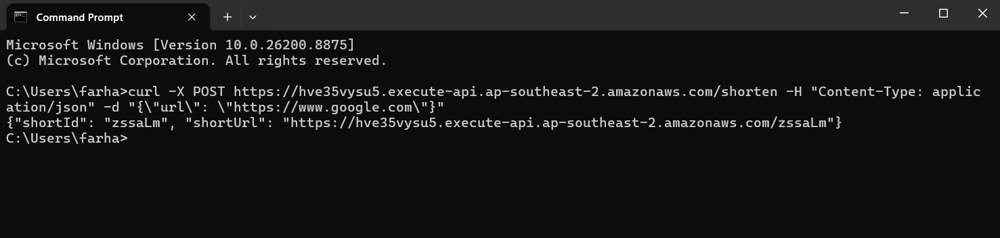
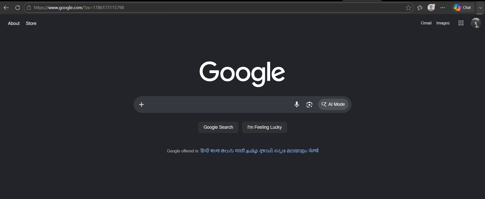
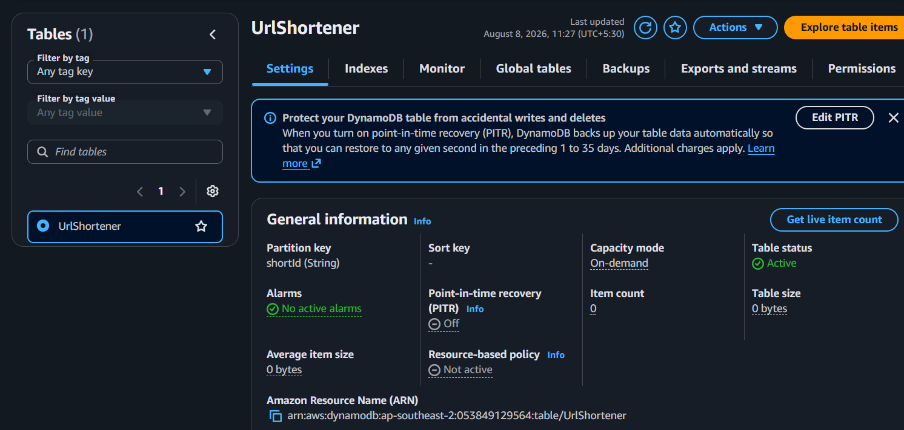

# Serverless URL Shortener

A fully serverless URL shortener built on AWS — submit a long URL via a REST API and get back a short link that redirects to the original when visited. No servers to manage, pay-per-use pricing, scales automatically.


---

## 📐 Architecture

```
                      POST /shorten
   Client  ─────────────────────────▶  API Gateway (HTTP API)
                                              │
                                              ▼
                                    Lambda: createShortUrl
                                              │
                                    generates random shortId
                                              │
                                              ▼
                                         DynamoDB
                                    (shortId ─▶ longUrl)


                      GET /{shortId}
   Client  ─────────────────────────▶  API Gateway (HTTP API)
                                              │
                                              ▼
                                   Lambda: redirectShortUrl
                                              │
                                     looks up shortId
                                              │
                                              ▼
                                         DynamoDB
                                              │
                                              ▼
                                  301 Redirect ─▶ original URL
```

**Component breakdown:**

| Component | Service | Purpose |
|---|---|---|
| **API layer** | Amazon API Gateway (HTTP API) | Exposes `POST /shorten` and `GET /{shortId}` endpoints |
| **Compute** | AWS Lambda (Python 3.13) — 2 functions | Business logic for creation and redirection |
| **Storage** | Amazon DynamoDB (on-demand) | Stores the `shortId → longUrl` mapping |
| **Access control** | IAM execution roles | Scoped permissions per Lambda function |

---

## ✨ Features

- Generate a short URL from any long URL via a single API call
- Instant 301 redirect from the short URL to the original destination
- Fully serverless — zero infrastructure to provision or patch
- Pay-per-request DynamoDB billing — no idle capacity costs
- Auto-scales with traffic; no cold-start management required at this scale
- Clean separation of concerns — one Lambda per responsibility

---

## 🛠️ Tech Stack

- **Compute:** AWS Lambda (Python 3.13)
- **API:** Amazon API Gateway — HTTP API
- **Database:** Amazon DynamoDB (on-demand capacity)
- **IAM:** Per-function execution roles

---

## ☁️ AWS Services Used

- **DynamoDB** — single table (`UrlShortener`) with `shortId` as the partition key
- **Lambda (×2)**
  - `createShortUrl` — generates a short ID and writes the mapping to DynamoDB
  - `redirectShortUrl` — reads the mapping and issues a `301` redirect
- **API Gateway (HTTP API)** — routes `POST /shorten` and `GET /{shortId}` to their respective Lambda functions, deployed on the `$default` auto-deploy stage
- **IAM** — execution roles granting each Lambda DynamoDB access

---

## 📁 Project Structure

```
serverless-url-shortener/
├── createShortUrl/
│   └── lambda_function.py     # Generates shortId, writes to DynamoDB
├── redirectShortUrl/
│   └── lambda_function.py     # Looks up shortId, returns 301 redirect
├── screenshots/               # Working demo screenshots
└── README.md
```

---

## 🚀 Getting Started

### Prerequisites

- An AWS account (not the root user — use an IAM user with admin access for setup)
- AWS CLI configured (`aws configure`) — optional, only needed for CLI-based deployment

### 1. Create the DynamoDB table

| Setting | Value |
|---|---|
| Table name | `UrlShortener` |
| Partition key | `shortId` (String) |
| Capacity mode | On-demand |

### 2. Create the Lambda functions

Create two functions with runtime **Python 3.13**, and paste in the corresponding code from this repo:

- `createShortUrl` → `createShortUrl/lambda_function.py`
- `redirectShortUrl` → `redirectShortUrl/lambda_function.py`

Attach `AmazonDynamoDBFullAccess` to each function's execution role. *(For learning purposes — see [Security Notes](#-security-notes) for the production-grade approach.)*

### 3. Create the API Gateway

- Create an **HTTP API** named `UrlShortenerApi`
- Add two routes:

| Method | Path | Integration |
|---|---|---|
| `POST` | `/shorten` | `createShortUrl` |
| `GET` | `/{shortId}` | `redirectShortUrl` |

- Deploy to the `$default` stage with auto-deploy enabled

---

## 🔌 API Reference

### `POST /shorten`

Creates a new short URL.

**Request body:**
```json
{
  "url": "https://www.google.com"
}
```

**Success response:**
```json
{
  "shortId": "zssaLm",
  "shortUrl": "https://<api-id>.execute-api.<region>.amazonaws.com/zssaLm"
}
```

**Error response:**
```json
{
  "error": "Missing \"url\" in request body"
}
```

### `GET /{shortId}`

Redirects to the original URL if `shortId` exists.

- **Found** → `301 Moved Permanently`, `Location` header set to the original URL
- **Not found** → `404` with an error message

---

## 🧪 Testing

```bash
curl -X POST https://<api-id>.execute-api.<region>.amazonaws.com/shorten \
  -H "Content-Type: application/json" \
  -d "{\"url\": \"https://www.google.com\"}"
```

Response:
```json
{"shortId": "zssaLm", "shortUrl": "https://<api-id>.execute-api.<region>.amazonaws.com/zssaLm"}
```

Visiting the returned `shortUrl` in a browser redirects straight to the original URL.

---

## 🗄️ Data Model

DynamoDB table `UrlShortener`:

| Attribute | Type | Description |
|---|---|---|
| `shortId` (partition key) | String | Randomly generated 6-character ID |
| `longUrl` | String | The original, full-length URL |

---

## 🖼️ Screenshots

| | |
|---|---|
| **Creating a short URL** | **Redirect in action** |
|  |  |
| **DynamoDB table** | |
|  | |

---

## 🔒 Security Notes

- Use an **IAM user**, never the AWS root account, for day-to-day work — enable MFA on both.
- Replace `AmazonDynamoDBFullAccess` with a scoped policy limited to `GetItem`/`PutItem` on the `UrlShortener` table only (least privilege).
- Add input validation on `/shorten` to reject malformed or non-HTTP(S) URLs.
- Consider rate limiting on API Gateway (usage plans / throttling) to prevent abuse.

---

## 📈 What I'd Change for Production

- **Least-privilege IAM** — scoped DynamoDB policy instead of full access
- **Custom domain + HTTPS** via Route 53 and ACM instead of the raw API Gateway URL
- **TTL on DynamoDB items** to auto-expire old short links
- **CloudWatch alarms** on Lambda errors/throttles and API Gateway 5xx rates
- **Infrastructure as Code** — rebuild this in Terraform for repeatable, version-controlled deployments
- **Analytics** — track click counts per short URL

---

## 💰 Cost

At low traffic, this project runs within the AWS Free Tier: Lambda (1M free requests/month), DynamoDB on-demand (25 GB free storage), and API Gateway HTTP API's free tier — effectively **$0/month** for a personal project or demo.

---

## 📄 License

This project is available for personal and educational use. Add a license file (e.g., MIT) if you plan to distribute or open-source it. Thank You.
